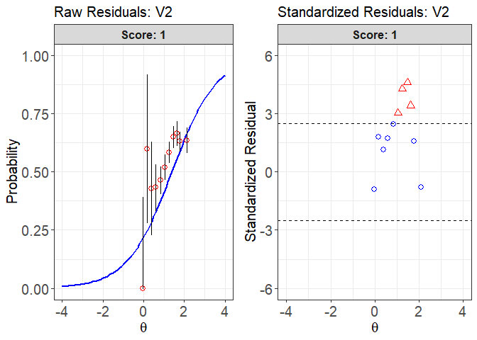
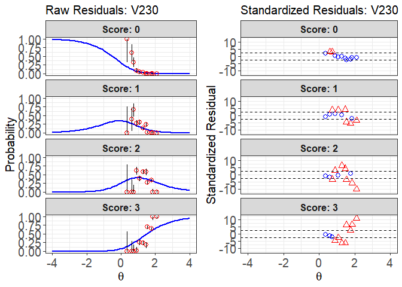

<!-- README.md is generated from README.Rmd. Please edit that file -->

# irtplay

The goal of `irtplay` is to examine the IRT model-data fit on item-level
in different ways as well as provide useful functions related to
unidimensional item response theory (IRT). In terms of assessing the IRT
model-data fit, one of distinguished features of this package is that it
gives not only item fit statistics (e.g., chi-square fit statistic (X2;
e.g., Bock, 1960; Yen, 1981), likelihood ratio chi-square fit statistic
(G2; McKinley & Mills, 1985), infit and outfit statistics (Ames et al.,
2015), and S-X2 (Orlando & Thissen, 2000, 2003)) but also graphical
displays to look at residuals between between the observed data and
model-based predictions (Hambleton, Swaminathan, & Rogers, 1991). More
evaluation methods will be included in the future updated version. In
addition to the evaluation of IRT model-data fit, there are several
useful functions such as estimating proficiency parameters, calibrating
item parameters given the fixed effects (aka. ability values), computing
asymptotic variance-covariance matrices of item parameter estimates,
importing item and/or ability parameters from popular IRT software,
generating simulated data, computing the conditional distribution of
observed scores using the Lord-Wingersky recursion formula, computing
item and test information functions, computing item and test
characteristic curve functions, and plotting item and test
characteristic curves and item and test information functions.

## Installation

You can install the released version of irtplay from
[CRAN](https://CRAN.R-project.org) with:

``` r
install.packages("irtplay")
```

### The process of evaluating the IRT model-data fit

One way to assess goodness of IRT model-data fit is through an item fit
analysis by examining the traditional item fit statistics and looking at
the discrepancy between the observed data and model-based predictions.
Using `irtplay` package, the traditional approach of evaluating the IRT
model-data fit on item-level can be implemented with three main steps:

1.  Prepare a data set for the IRT item fit analysis (i.e., item meta
    data, ability estimates, and response data).
2.  Obtain the IRT fit statistics such as the X2, G2, infit, and outfit
    statistics using the `irtfit` function.
3.  Based on the results of IRT model fit analysis (i.e., an object of
    class `irtfit`) obtained in step 2, draw the IRT residual plots
    (i.e., raw residual and standardized residual plots) using `plot`
    method.

## 1\. Preparing a data set

Before conducting the IRT model fit analysis, it is necessary to prepare
a data set. To run the `irtfit` function, it requires three data sets:

1.  Item meta data including the item ID, number of score categories,
    IRT models, and item parameters. The item meta data should be in the
    format of data.frame. You can prepare the data either by using the
    `shape_df` function or by creating a data.frame of the item meta
    data by yourself. If you have output files of item parameter
    estimates obtained from one of the IRT software such as BILOG-MG 3,
    PARSCALE 4, flexMIRT, and mirt (R package), the item meta data can
    be easily obtained using the functions of `bring.bilog`,
    `bring.parscale`, `bring.flexmirt`, `bring.mirt`. See the functions
    of `irtfit`, `test.info`, or `simdat` for more details about the
    item meta data format.
2.  Examinees’ ability (or proficiency) estimates. It should be in the
    format of a numeric vector.
3.  Examinees’ response data set for the items. It should be in the
    format of matrix where a row and column indicate the examinees and
    the items, respectively. The order of the examinees in the response
    data set must be exactly the same as that of the examinees’ ability
    estimates. The order of the items in the response data set must be
    exactly the same as that of the items in the item meta data.

## 2\. Computing the IRT model-data fit statistics

The `irtfit` function computes the traditional IRT item fit statistics
such as X2, G2, infit, and outfit statistics. To calculate the X2 and G2
statistics, two methods are available to divide the ability scale into
several groups. The two methods are “equal.width” for dividing the scale
by an equal length of the interval and “equal.freq” for dividing the
scale by an equal frequency of examinees. Also, you need to specify the
location of ability point at each group (or interval) where the expected
probabilities of score categories are calculated from the IRT models.
Available locations are “average” for computing the expected probability
at the average point of examinees’ ability estimates in each group and
“middle” for computing the expected probability at the midpoint of
each group.

To use the `irtfit` function, you need to insert the item meta data in
the argument `x`, the ability estimates in the argument `score`, and the
response data in the argument `data`. If you want to divide the ability
scale into other than ten groups, you need to specify the number of
groups in the argument `n.width`. In addition, if the response data
include missing values, you must indicate the missing value in argument
`missing`.

Once the `irtfit` function has been implemented, you’ll get the fit
statistic results and the contingency tables for every item used to
calculate the X2 and G2 fit statistics.

## 3\. Drawing the IRT residual plots

Using the saved object of class `irtfit`, you can use the `plot` method
to evaluate the IRT raw residual and standardized residual plots.

Because the `plot` method can draw the residual plots for an item at a
time, you have to indicate which item will be examined. For this, you
can specify an integer value, which is the location of the studied item,
in the argument `item.loc`.

In terms of the raw residual plot, the argument `ci.method` is used to
select a method to estimate the confidence intervals among four methods.
Those methods are “wald” for the Wald interval, which is based on the
normal approximation (Laplace, 1812), “cp” for Clopper-Pearson interval
(Clopper & Pearson, 1934), “wilson” for Wilson score interval (Wilson,
1927), and “wilson.cr” for Wilson score interval with continuity
correction (Newcombe, 1998).

### Example code for the three main steps described above

The example code below shows how to prepare the data sets and how to
conduct the IRT model-data fit analysis:

``` r
library(irtplay)

##----------------------------------------------------------------------------
## Step 1: prepare a data set for IRT
## In this example, we use the simulated mixed-item format CAT Data
## But, only items that have item responses more than 1,000 are assessed.

# find the location of items that have more than 1,000 item responses
over1000 <- which(colSums(simCAT_MX$res.dat, na.rm=TRUE) > 1000)

# (1) item meta data
x <- simCAT_MX$item.prm[over1000, ]
dim(x)
#> [1] 113   7
print(x[1:10, ])
#>     id cats model     par.1      par.2 par.3 par.4
#> 2   V2    2  2PLM 0.9152754  1.3843593    NA    NA
#> 3   V3    2  2PLM 1.3454796 -1.2554919    NA    NA
#> 5   V5    2  2PLM 1.0862914  1.7114409    NA    NA
#> 6   V6    2  2PLM 1.1311496 -0.6029080    NA    NA
#> 7   V7    2  2PLM 1.2012407 -0.4721664    NA    NA
#> 8   V8    2  2PLM 1.3244155 -0.6353713    NA    NA
#> 10 V10    2  2PLM 1.2487125  0.1381082    NA    NA
#> 11 V11    2  2PLM 1.4413208  1.2276303    NA    NA
#> 12 V12    2  2PLM 1.2077273 -0.8017795    NA    NA
#> 13 V13    2  2PLM 1.1715456 -1.0803926    NA    NA

# (2) examinee's ability estimates
score <- simCAT_MX$score
length(score)
#> [1] 30000
print(score[1:100])
#>   [1] -0.30311440 -0.67224807 -0.73474583  1.76935738 -0.91017203
#>   [6] -0.28448278  0.81656431 -1.66434615  0.59312008 -0.35182937
#>  [11]  0.23129679 -0.93107524 -0.29971993 -0.32700449 -0.22271651
#>  [16]  1.48912121 -0.92927809  0.43453041 -0.01795450 -0.28365286
#>  [21]  0.01115173 -0.76101441  0.12144273  0.83096135  1.96600585
#>  [26] -0.83510402 -0.40268865 -0.05605526  0.72398446 -0.16026059
#>  [31] -1.09011778  1.22126764 -0.13340360 -1.28230720 -1.05581980
#>  [36]  0.83484173 -0.52136360 -0.66913590 -1.08580804  1.73214834
#>  [41]  0.56950387  0.48016332 -0.03472720 -2.17577824  0.44127032
#>  [46]  0.98913071  1.43861714 -1.08133809 -0.69016072  0.19325797
#>  [51]  0.89998383  1.25383167 -1.09600809  0.50519143 -0.51707395
#>  [56] -0.39474484 -0.45031102  1.85675021  1.50768131  1.06011811
#>  [61] -0.41064797  1.10960278 -0.68853387 -0.59397660 -0.65326436
#>  [66]  0.29147751 -1.86787473  1.04838050 -1.14582092  1.07395234
#>  [71] -0.03828693  0.08445559  0.34582524  0.72300905  0.84448992
#>  [76] -1.86488055  0.77121937  1.66573208  0.10311673 -0.50768866
#>  [81] -1.60992457 -0.23074682  0.16162326  0.26091160  0.60682182
#>  [86]  0.65415304 -0.69923141  1.07545766  0.24060267 -0.93542383
#>  [91]  1.24988766 -0.01826940  1.27403936  0.10985621 -1.19092047
#>  [96]  0.79614598  0.62302338 -0.89455596 -0.03472720  0.20250837

# (3) response data
data <- simCAT_MX$res.dat[, over1000]
dim(data)
#> [1] 30000   113
print(data[1:20, 1:6])
#>       Item.dc.2 Item.dc.3 Item.dc.5 Item.dc.6 Item.dc.7 Item.dc.8
#>  [1,]        NA        NA        NA        NA         0         1
#>  [2,]        NA        NA        NA        NA         0         1
#>  [3,]        NA        NA        NA        NA         1         1
#>  [4,]        NA        NA         0        NA        NA        NA
#>  [5,]        NA         1        NA         0         1         1
#>  [6,]        NA         0        NA         0         1         0
#>  [7,]        NA        NA        NA        NA        NA        NA
#>  [8,]        NA         1        NA         1         1         0
#>  [9,]        NA        NA         0        NA        NA        NA
#> [10,]        NA         0        NA         1         1         0
#> [11,]        NA        NA         0        NA        NA        NA
#> [12,]        NA         1        NA         0         1         1
#> [13,]        NA         0        NA         1         1         0
#> [14,]        NA        NA        NA        NA         1        NA
#> [15,]        NA        NA        NA         1         1         1
#> [16,]         1        NA         0        NA        NA        NA
#> [17,]        NA         0        NA         0         1         0
#> [18,]        NA        NA        NA        NA        NA        NA
#> [19,]        NA         0        NA         0         1         1
#> [20,]        NA        NA        NA        NA        NA        NA

##----------------------------------------------------------------------------
## Step 2: Compute the IRT mode-data fit statistics
# (1) the use of "equal.width"  
fit1 <- irtfit(x=x, score=score, data=data, group.method="equal.width",
               n.width=11, loc.theta="average", range.score=c(-4, 4), D=1, alpha=0.05,
               missing=NA, overSR = 2.5)

# what kinds of internal objects does the results have?
names(fit1)
#> [1] "fit_stat"            "contingency.fitstat" "contingency.plot"   
#> [4] "item_df"             "individual.info"     "ancillary"          
#> [7] "call"

# show the results of the fit statistics
fit1$fit_stat[1:10, ]
#>     id      X2      G2 df.X2 df.G2 crit.value.X2 crit.value.G2 p.value.X2
#> 1   V2  75.070  75.209     8    10         15.51         18.31          0
#> 2   V3 186.880 168.082     8    10         15.51         18.31          0
#> 3   V5 151.329 139.213     8    10         15.51         18.31          0
#> 4   V6 178.409 157.911     8    10         15.51         18.31          0
#> 5   V7 185.438 170.360     9    11         16.92         19.68          0
#> 6   V8 209.653 193.001     8    10         15.51         18.31          0
#> 7  V10 267.444 239.563     9    11         16.92         19.68          0
#> 8  V11 148.896 133.209     7     9         14.07         16.92          0
#> 9  V12 139.295 125.647     9    11         16.92         19.68          0
#> 10 V13 128.422 117.439     9    11         16.92         19.68          0
#>    p.value.G2 outfit infit     N overSR.prop
#> 1           0  1.018 1.016  2018       0.364
#> 2           0  1.124 1.090 11041       0.636
#> 3           0  1.133 1.111  5181       0.727
#> 4           0  1.056 1.045 13599       0.545
#> 5           0  1.078 1.059 18293       0.455
#> 6           0  1.098 1.075 16163       0.636
#> 7           0  1.097 1.073 19702       0.727
#> 8           0  1.129 1.083 13885       0.455
#> 9           0  1.065 1.051 12118       0.636
#> 10          0  1.075 1.059 10719       0.545

# show the contingency tables for the first item (dichotomous)
fit1$contingency.fitstat[[1]]
#>      N freq.0 freq.1 obs.prop.0 obs.prop.1 exp.prob.0 exp.prob.1
#> 1    8      5      3  0.6250000  0.3750000  0.7627914  0.2372086
#> 2   14      8      6  0.5714286  0.4285714  0.7121079  0.2878921
#> 3   60     34     26  0.5666667  0.4333333  0.6708959  0.3291041
#> 4  185     99     86  0.5351351  0.4648649  0.6230537  0.3769463
#> 5  240    115    125  0.4791667  0.5208333  0.5765337  0.4234663
#> 6  349    145    204  0.4154728  0.5845272  0.5301760  0.4698240
#> 7  325    114    211  0.3507692  0.6492308  0.4784096  0.5215904
#> 8  246     82    164  0.3333333  0.6666667  0.4419993  0.5580007
#> 9  377    139    238  0.3687003  0.6312997  0.4086532  0.5913468
#> 10 214     78    136  0.3644860  0.6355140  0.3394647  0.6605353
#>    raw_resid.0 raw_resid.1
#> 1  -0.13779141  0.13779141
#> 2  -0.14067932  0.14067932
#> 3  -0.10422928  0.10422928
#> 4  -0.08791853  0.08791853
#> 5  -0.09736699  0.09736699
#> 6  -0.11470327  0.11470327
#> 7  -0.12764036  0.12764036
#> 8  -0.10866594  0.10866594
#> 9  -0.03995295  0.03995295
#> 10  0.02502128 -0.02502128


# (2) the use of "equal.freq"  
fit2 <- irtfit(x=x, score=score, data=data, group.method="equal.freq",
               n.width=11, loc.theta="average", range.score=c(-4, 4), D=1, alpha=0.05,
               missing=NA)

# show the results of the fit statistics
fit2$fit_stat[1:10, ]
#>     id      X2      G2 df.X2 df.G2 crit.value.X2 crit.value.G2 p.value.X2
#> 1   V2  77.967  78.144     9    11         16.92         19.68          0
#> 2   V3 202.035 181.832     9    11         16.92         19.68          0
#> 3   V5 146.383 135.908     9    11         16.92         19.68          0
#> 4   V6 140.038 133.287     9    11         16.92         19.68          0
#> 5   V7 188.814 177.526     9    11         16.92         19.68          0
#> 6   V8 211.279 196.328     9    11         16.92         19.68          0
#> 7  V10 259.669 239.292     9    11         16.92         19.68          0
#> 8  V11 166.427 150.419     9    11         16.92         19.68          0
#> 9  V12 145.789 134.690     9    11         16.92         19.68          0
#> 10 V13 141.283 132.270     9    11         16.92         19.68          0
#>    p.value.G2 outfit infit     N overSR.prop
#> 1           0  1.018 1.016  2018       0.727
#> 2           0  1.124 1.090 11041       0.636
#> 3           0  1.133 1.111  5181       0.727
#> 4           0  1.056 1.045 13599       0.545
#> 5           0  1.078 1.059 18293       0.455
#> 6           0  1.098 1.075 16163       0.545
#> 7           0  1.097 1.073 19702       0.636
#> 8           0  1.129 1.083 13885       0.636
#> 9           0  1.065 1.051 12118       0.364
#> 10          0  1.075 1.059 10719       0.636

# show the contingency table for the fourth item (polytomous)
fit2$contingency.fitstat[[4]]
#>       N freq.0 freq.1 obs.prop.0 obs.prop.1 exp.prob.0 exp.prob.1
#> 1  1241    967    274  0.7792103  0.2207897  0.8038510  0.1961490
#> 2  1243    879    364  0.7071601  0.2928399  0.7161793  0.2838207
#> 3  1243    784    459  0.6307321  0.3692679  0.6575849  0.3424151
#> 4  1219    747    472  0.6127974  0.3872026  0.6049393  0.3950607
#> 5  1236    705    531  0.5703883  0.4296117  0.5613454  0.4386546
#> 6  1243    677    566  0.5446500  0.4553500  0.5279560  0.4720440
#> 7  1270    662    608  0.5212598  0.4787402  0.4925592  0.5074408
#> 8  1230    616    614  0.5008130  0.4991870  0.4491759  0.5508241
#> 9  1207    553    654  0.4581607  0.5418393  0.4027790  0.5972210
#> 10 1233    494    739  0.4006488  0.5993512  0.3509261  0.6490739
#> 11 1234    465    769  0.3768233  0.6231767  0.2630181  0.7369819
#>     raw_resid.0  raw_resid.1
#> 1  -0.024640641  0.024640641
#> 2  -0.009019180  0.009019180
#> 3  -0.026852795  0.026852795
#> 4   0.007858099 -0.007858099
#> 5   0.009042942 -0.009042942
#> 6   0.016694048 -0.016694048
#> 7   0.028700633 -0.028700633
#> 8   0.051637085 -0.051637085
#> 9   0.055381721 -0.055381721
#> 10  0.049722759 -0.049722759
#> 11  0.113805214 -0.113805214


##----------------------------------------------------------------------------
## Step 3: Draw the IRT residual plots 
# 1. the dichotomous item
# (1) both raw and standardized residual plots using the object "fit1"  
plot(x=fit1, item.loc=1, type = "both", ci.method = "wald",  ylim.sr.adjust=TRUE)
```


    #>                               theta   N freq.0 freq.1 obs.prop.0
    #> [-0.1218815,0.08512996] -0.02529272   3      3      0  1.0000000
    #> (0.08512996,0.2921415]   0.18431014   5      2      3  0.4000000
    #> (0.2921415,0.499153]     0.39488272  14      8      6  0.5714286
    #> (0.499153,0.7061645]     0.60618911  60     34     26  0.5666667
    #> (0.7061645,0.913176]     0.83531169 185     99     86  0.5351351
    #> (0.913176,1.120187]      1.04723712 240    115    125  0.4791667
    #> (1.120187,1.327199]      1.25232143 349    145    204  0.4154728
    #> (1.327199,1.53421]       1.47877397 325    114    211  0.3507692
    #> (1.53421,1.741222]       1.63898436 246     82    164  0.3333333
    #> (1.741222,1.948233]      1.78810197 377    139    238  0.3687003
    #> (1.948233,2.155245]      2.11166019 214     78    136  0.3644860
    #>                         obs.prop.1 exp.prob.0 exp.prob.1 raw_resid.0
    #> [-0.1218815,0.08512996]  0.0000000  0.7841844  0.2158156  0.21581559
    #> (0.08512996,0.2921415]   0.6000000  0.7499556  0.2500444 -0.34995561
    #> (0.2921415,0.499153]     0.4285714  0.7121079  0.2878921 -0.14067932
    #> (0.499153,0.7061645]     0.4333333  0.6708959  0.3291041 -0.10422928
    #> (0.7061645,0.913176]     0.4648649  0.6230537  0.3769463 -0.08791853
    #> (0.913176,1.120187]      0.5208333  0.5765337  0.4234663 -0.09736699
    #> (1.120187,1.327199]      0.5845272  0.5301760  0.4698240 -0.11470327
    #> (1.327199,1.53421]       0.6492308  0.4784096  0.5215904 -0.12764036
    #> (1.53421,1.741222]       0.6666667  0.4419993  0.5580007 -0.10866594
    #> (1.741222,1.948233]      0.6312997  0.4086532  0.5913468 -0.03995295
    #> (1.948233,2.155245]      0.6355140  0.3394647  0.6605353  0.02502128
    #>                         raw_resid.1       se.0       se.1 std_resid.0
    #> [-0.1218815,0.08512996] -0.21581559 0.23751437 0.23751437   0.9086423
    #> (0.08512996,0.2921415]   0.34995561 0.19366063 0.19366063  -1.8070560
    #> (0.2921415,0.499153]     0.14067932 0.12101070 0.12101070  -1.1625362
    #> (0.499153,0.7061645]     0.10422928 0.06066226 0.06066226  -1.7181899
    #> (0.7061645,0.913176]     0.08791853 0.03563007 0.03563007  -2.4675377
    #> (0.913176,1.120187]      0.09736699 0.03189453 0.03189453  -3.0527806
    #> (1.120187,1.327199]      0.11470327 0.02671560 0.02671560  -4.2934941
    #> (1.327199,1.53421]       0.12764036 0.02770914 0.02770914  -4.6064351
    #> (1.53421,1.741222]       0.10866594 0.03166362 0.03166362  -3.4318859
    #> (1.741222,1.948233]      0.03995295 0.02531791 0.02531791  -1.5780508
    #> (1.948233,2.155245]     -0.02502128 0.03236968 0.03236968   0.7729850
    #>                         std_resid.1 raw.resid.0 raw.resid.1     se.0.1
    #> [-0.1218815,0.08512996]  -0.9086423  0.21581559 -0.21581559 0.23751437
    #> (0.08512996,0.2921415]    1.8070560 -0.34995561  0.34995561 0.19366063
    #> (0.2921415,0.499153]      1.1625362 -0.14067932  0.14067932 0.12101070
    #> (0.499153,0.7061645]      1.7181899 -0.10422928  0.10422928 0.06066226
    #> (0.7061645,0.913176]      2.4675377 -0.08791853  0.08791853 0.03563007
    #> (0.913176,1.120187]       3.0527806 -0.09736699  0.09736699 0.03189453
    #> (1.120187,1.327199]       4.2934941 -0.11470327  0.11470327 0.02671560
    #> (1.327199,1.53421]        4.6064351 -0.12764036  0.12764036 0.02770914
    #> (1.53421,1.741222]        3.4318859 -0.10866594  0.10866594 0.03166362
    #> (1.741222,1.948233]       1.5780508 -0.03995295  0.03995295 0.02531791
    #> (1.948233,2.155245]      -0.7729850  0.02502128 -0.02502128 0.03236968
    #>                             se.1.1 std.resid.0 std.resid.1
    #> [-0.1218815,0.08512996] 0.23751437   0.9086423  -0.9086423
    #> (0.08512996,0.2921415]  0.19366063  -1.8070560   1.8070560
    #> (0.2921415,0.499153]    0.12101070  -1.1625362   1.1625362
    #> (0.499153,0.7061645]    0.06066226  -1.7181899   1.7181899
    #> (0.7061645,0.913176]    0.03563007  -2.4675377   2.4675377
    #> (0.913176,1.120187]     0.03189453  -3.0527806   3.0527806
    #> (1.120187,1.327199]     0.02671560  -4.2934941   4.2934941
    #> (1.327199,1.53421]      0.02770914  -4.6064351   4.6064351
    #> (1.53421,1.741222]      0.03166362  -3.4318859   3.4318859
    #> (1.741222,1.948233]     0.02531791  -1.5780508   1.5780508
    #> (1.948233,2.155245]     0.03236968   0.7729850  -0.7729850
    
    # (2) the raw residual plots using the object "fit1"  
    plot(x=fit1, item.loc=1, type = "icc", ci.method = "wald",  ylim.sr.adjust=TRUE)



    #>                               theta   N freq.0 freq.1 obs.prop.0
    #> [-0.1218815,0.08512996] -0.02529272   3      3      0  1.0000000
    #> (0.08512996,0.2921415]   0.18431014   5      2      3  0.4000000
    #> (0.2921415,0.499153]     0.39488272  14      8      6  0.5714286
    #> (0.499153,0.7061645]     0.60618911  60     34     26  0.5666667
    #> (0.7061645,0.913176]     0.83531169 185     99     86  0.5351351
    #> (0.913176,1.120187]      1.04723712 240    115    125  0.4791667
    #> (1.120187,1.327199]      1.25232143 349    145    204  0.4154728
    #> (1.327199,1.53421]       1.47877397 325    114    211  0.3507692
    #> (1.53421,1.741222]       1.63898436 246     82    164  0.3333333
    #> (1.741222,1.948233]      1.78810197 377    139    238  0.3687003
    #> (1.948233,2.155245]      2.11166019 214     78    136  0.3644860
    #>                         obs.prop.1 exp.prob.0 exp.prob.1 raw_resid.0
    #> [-0.1218815,0.08512996]  0.0000000  0.7841844  0.2158156  0.21581559
    #> (0.08512996,0.2921415]   0.6000000  0.7499556  0.2500444 -0.34995561
    #> (0.2921415,0.499153]     0.4285714  0.7121079  0.2878921 -0.14067932
    #> (0.499153,0.7061645]     0.4333333  0.6708959  0.3291041 -0.10422928
    #> (0.7061645,0.913176]     0.4648649  0.6230537  0.3769463 -0.08791853
    #> (0.913176,1.120187]      0.5208333  0.5765337  0.4234663 -0.09736699
    #> (1.120187,1.327199]      0.5845272  0.5301760  0.4698240 -0.11470327
    #> (1.327199,1.53421]       0.6492308  0.4784096  0.5215904 -0.12764036
    #> (1.53421,1.741222]       0.6666667  0.4419993  0.5580007 -0.10866594
    #> (1.741222,1.948233]      0.6312997  0.4086532  0.5913468 -0.03995295
    #> (1.948233,2.155245]      0.6355140  0.3394647  0.6605353  0.02502128
    #>                         raw_resid.1       se.0       se.1 std_resid.0
    #> [-0.1218815,0.08512996] -0.21581559 0.23751437 0.23751437   0.9086423
    #> (0.08512996,0.2921415]   0.34995561 0.19366063 0.19366063  -1.8070560
    #> (0.2921415,0.499153]     0.14067932 0.12101070 0.12101070  -1.1625362
    #> (0.499153,0.7061645]     0.10422928 0.06066226 0.06066226  -1.7181899
    #> (0.7061645,0.913176]     0.08791853 0.03563007 0.03563007  -2.4675377
    #> (0.913176,1.120187]      0.09736699 0.03189453 0.03189453  -3.0527806
    #> (1.120187,1.327199]      0.11470327 0.02671560 0.02671560  -4.2934941
    #> (1.327199,1.53421]       0.12764036 0.02770914 0.02770914  -4.6064351
    #> (1.53421,1.741222]       0.10866594 0.03166362 0.03166362  -3.4318859
    #> (1.741222,1.948233]      0.03995295 0.02531791 0.02531791  -1.5780508
    #> (1.948233,2.155245]     -0.02502128 0.03236968 0.03236968   0.7729850
    #>                         std_resid.1 raw.resid.0 raw.resid.1     se.0.1
    #> [-0.1218815,0.08512996]  -0.9086423  0.21581559 -0.21581559 0.23751437
    #> (0.08512996,0.2921415]    1.8070560 -0.34995561  0.34995561 0.19366063
    #> (0.2921415,0.499153]      1.1625362 -0.14067932  0.14067932 0.12101070
    #> (0.499153,0.7061645]      1.7181899 -0.10422928  0.10422928 0.06066226
    #> (0.7061645,0.913176]      2.4675377 -0.08791853  0.08791853 0.03563007
    #> (0.913176,1.120187]       3.0527806 -0.09736699  0.09736699 0.03189453
    #> (1.120187,1.327199]       4.2934941 -0.11470327  0.11470327 0.02671560
    #> (1.327199,1.53421]        4.6064351 -0.12764036  0.12764036 0.02770914
    #> (1.53421,1.741222]        3.4318859 -0.10866594  0.10866594 0.03166362
    #> (1.741222,1.948233]       1.5780508 -0.03995295  0.03995295 0.02531791
    #> (1.948233,2.155245]      -0.7729850  0.02502128 -0.02502128 0.03236968
    #>                             se.1.1 std.resid.0 std.resid.1
    #> [-0.1218815,0.08512996] 0.23751437   0.9086423  -0.9086423
    #> (0.08512996,0.2921415]  0.19366063  -1.8070560   1.8070560
    #> (0.2921415,0.499153]    0.12101070  -1.1625362   1.1625362
    #> (0.499153,0.7061645]    0.06066226  -1.7181899   1.7181899
    #> (0.7061645,0.913176]    0.03563007  -2.4675377   2.4675377
    #> (0.913176,1.120187]     0.03189453  -3.0527806   3.0527806
    #> (1.120187,1.327199]     0.02671560  -4.2934941   4.2934941
    #> (1.327199,1.53421]      0.02770914  -4.6064351   4.6064351
    #> (1.53421,1.741222]      0.03166362  -3.4318859   3.4318859
    #> (1.741222,1.948233]     0.02531791  -1.5780508   1.5780508
    #> (1.948233,2.155245]     0.03236968   0.7729850  -0.7729850
    
    # (3) the standardized residual plots using the object "fit1"  
    plot(x=fit1, item.loc=113, type = "sr", ci.method = "wald",  ylim.sr.adjust=TRUE)


    #>                           theta   N freq.0 freq.1 freq.2 freq.3 obs.prop.0
    #> [0.3564295,0.5199582] 0.3564295   1      1      0      0      0 1.00000000
    #> (0.5199582,0.6834869] 0.6081321   5      3      2      0      0 0.60000000
    #> (0.6834869,0.8470155] 0.7400138  15      5     10      0      0 0.33333333
    #> (0.8470155,1.010544]  0.8866202  55      5     15     34      1 0.09090909
    #> (1.010544,1.174073]   1.0821064 133      6     40     53     34 0.04511278
    #> (1.174073,1.337602]   1.2832293 260      8     37    153     62 0.03076923
    #> (1.337602,1.50113]    1.4747336  98      0     23     57     18 0.00000000
    #> (1.50113,1.664659]    1.5311735 306      0      7     85    214 0.00000000
    #> (1.664659,1.828188]   1.7632607 418      0      0    145    273 0.00000000
    #> (1.828188,1.991716]   1.8577191  69      0      0      0     69 0.00000000
    #> (1.991716,2.155245]   2.1021956 263      0      0      0    263 0.00000000
    #>                       obs.prop.1 obs.prop.2 obs.prop.3  exp.prob.0
    #> [0.3564295,0.5199582] 0.00000000  0.0000000 0.00000000 0.196511833
    #> (0.5199582,0.6834869] 0.40000000  0.0000000 0.00000000 0.130431315
    #> (0.6834869,0.8470155] 0.66666667  0.0000000 0.00000000 0.102631449
    #> (0.8470155,1.010544]  0.27272727  0.6181818 0.01818182 0.077129446
    #> (1.010544,1.174073]   0.30075188  0.3984962 0.25563910 0.051169395
    #> (1.174073,1.337602]   0.14230769  0.5884615 0.23846154 0.032494074
    #> (1.337602,1.50113]    0.23469388  0.5816327 0.18367347 0.020534959
    #> (1.50113,1.664659]    0.02287582  0.2777778 0.69934641 0.017857642
    #> (1.664659,1.828188]   0.00000000  0.3468900 0.65311005 0.009866868
    #> (1.828188,1.991716]   0.00000000  0.0000000 1.00000000 0.007690015
    #> (1.991716,2.155245]   0.00000000  0.0000000 1.00000000 0.003962699
    #>                       exp.prob.1 exp.prob.2 exp.prob.3  raw_resid.0
    #> [0.3564295,0.5199582] 0.31299790  0.3472692  0.1432210  0.803488167
    #> (0.5199582,0.6834869] 0.27025065  0.3900531  0.2092649  0.469568685
    #> (0.6834869,0.8470155] 0.24407213  0.4043226  0.2489738  0.230701885
    #> (0.8470155,1.010544]  0.21379299  0.4127992  0.2962784  0.013779645
    #> (1.010544,1.174073]   0.17398130  0.4120662  0.3627831 -0.006056613
    #> (1.174073,1.337602]   0.13632441  0.3983962  0.4327853 -0.001724843
    #> (1.337602,1.50113]    0.10523862  0.3756891  0.4985373 -0.020534959
    #> (1.50113,1.664659]    0.09707782  0.3676106  0.5174539 -0.017857642
    #> (1.664659,1.828188]   0.06836048  0.3299158  0.5918569 -0.009866868
    #> (1.828188,1.991716]   0.05880602  0.3132481  0.6202558 -0.007690015
    #> (1.991716,2.155245]   0.03912356  0.2690653  0.6878484 -0.003962699
    #>                        raw_resid.1 raw_resid.2 raw_resid.3        se.0
    #> [0.3564295,0.5199582] -0.312997903 -0.34726922 -0.14322104 0.397359953
    #> (0.5199582,0.6834869]  0.129749354 -0.39005312 -0.20926492 0.150611412
    #> (0.6834869,0.8470155]  0.422594537 -0.40432265 -0.24897378 0.078357401
    #> (0.8470155,1.010544]   0.058934282  0.20538261 -0.27809653 0.035974863
    #> (1.010544,1.174073]    0.126770584 -0.01356995 -0.10714402 0.019106171
    #> (1.174073,1.337602]    0.005983284  0.19006531 -0.19432375 0.010996190
    #> (1.337602,1.50113]     0.129455259  0.20594357 -0.31486387 0.014326112
    #> (1.50113,1.664659]    -0.074201998 -0.08983281  0.18189246 0.007570744
    #> (1.664659,1.828188]   -0.068360484  0.01697418  0.06125317 0.004834464
    #> (1.828188,1.991716]   -0.058806016 -0.31324812  0.37974416 0.010516294
    #> (1.991716,2.155245]   -0.039123555 -0.26906531  0.31215156 0.003873963
    #>                             se.1       se.2       se.3 std_resid.0
    #> [0.3564295,0.5199582] 0.46371351 0.47610220 0.35029812   2.0220663
    #> (0.5199582,0.6834869] 0.19860274 0.21813376 0.18191928   3.1177497
    #> (0.6834869,0.8470155] 0.11090564 0.12671381 0.11165000   2.9442258
    #> (0.8470155,1.010544]  0.05528201 0.06638675 0.06156999   0.3830354
    #> (1.010544,1.174073]   0.03287157 0.04267975 0.04169091  -0.3169978
    #> (1.174073,1.337602]   0.02128019 0.03036171 0.03072722  -0.1568583
    #> (1.337602,1.50113]    0.03099761 0.04892172 0.05050741  -1.4333937
    #> (1.50113,1.664659]    0.01692484 0.02756294 0.02856568  -2.3587698
    #> (1.664659,1.828188]   0.01234350 0.02299737 0.02403956  -2.0409436
    #> (1.828188,1.991716]   0.02832213 0.05583668 0.05842604  -0.7312476
    #> (1.991716,2.155245]   0.01195570 0.02734578 0.02857270  -1.0229057
    #>                       std_resid.1 std_resid.2 std_resid.3  raw.resid.0
    #> [0.3564295,0.5199582]  -0.6749812  -0.7294006  -0.4088547  0.803488167
    #> (0.5199582,0.6834869]   0.6533110  -1.7881373  -1.1503175  0.469568685
    #> (0.6834869,0.8470155]   3.8103971  -3.1908333  -2.2299488  0.230701885
    #> (0.8470155,1.010544]    1.0660662   3.0937290  -4.5167547  0.013779645
    #> (1.010544,1.174073]     3.8565422  -0.3179482  -2.5699613 -0.006056613
    #> (1.174073,1.337602]     0.2811669   6.2600333  -6.3241558 -0.001724843
    #> (1.337602,1.50113]      4.1762987   4.2096551  -6.2340132 -0.020534959
    #> (1.50113,1.664659]     -4.3842081  -3.2591881   6.3675177 -0.017857642
    #> (1.664659,1.828188]    -5.5381760   0.7380923   2.5480159 -0.009866868
    #> (1.828188,1.991716]    -2.0763275  -5.6100775   6.4995706 -0.007690015
    #> (1.991716,2.155245]    -3.2723764  -9.8393733  10.9248190 -0.003962699
    #>                        raw.resid.1 raw.resid.2 raw.resid.3      se.0.1
    #> [0.3564295,0.5199582] -0.312997903 -0.34726922 -0.14322104 0.397359953
    #> (0.5199582,0.6834869]  0.129749354 -0.39005312 -0.20926492 0.150611412
    #> (0.6834869,0.8470155]  0.422594537 -0.40432265 -0.24897378 0.078357401
    #> (0.8470155,1.010544]   0.058934282  0.20538261 -0.27809653 0.035974863
    #> (1.010544,1.174073]    0.126770584 -0.01356995 -0.10714402 0.019106171
    #> (1.174073,1.337602]    0.005983284  0.19006531 -0.19432375 0.010996190
    #> (1.337602,1.50113]     0.129455259  0.20594357 -0.31486387 0.014326112
    #> (1.50113,1.664659]    -0.074201998 -0.08983281  0.18189246 0.007570744
    #> (1.664659,1.828188]   -0.068360484  0.01697418  0.06125317 0.004834464
    #> (1.828188,1.991716]   -0.058806016 -0.31324812  0.37974416 0.010516294
    #> (1.991716,2.155245]   -0.039123555 -0.26906531  0.31215156 0.003873963
    #>                           se.1.1     se.2.1     se.3.1 std.resid.0
    #> [0.3564295,0.5199582] 0.46371351 0.47610220 0.35029812   2.0220663
    #> (0.5199582,0.6834869] 0.19860274 0.21813376 0.18191928   3.1177497
    #> (0.6834869,0.8470155] 0.11090564 0.12671381 0.11165000   2.9442258
    #> (0.8470155,1.010544]  0.05528201 0.06638675 0.06156999   0.3830354
    #> (1.010544,1.174073]   0.03287157 0.04267975 0.04169091  -0.3169978
    #> (1.174073,1.337602]   0.02128019 0.03036171 0.03072722  -0.1568583
    #> (1.337602,1.50113]    0.03099761 0.04892172 0.05050741  -1.4333937
    #> (1.50113,1.664659]    0.01692484 0.02756294 0.02856568  -2.3587698
    #> (1.664659,1.828188]   0.01234350 0.02299737 0.02403956  -2.0409436
    #> (1.828188,1.991716]   0.02832213 0.05583668 0.05842604  -0.7312476
    #> (1.991716,2.155245]   0.01195570 0.02734578 0.02857270  -1.0229057
    #>                       std.resid.1 std.resid.2 std.resid.3
    #> [0.3564295,0.5199582]  -0.6749812  -0.7294006  -0.4088547
    #> (0.5199582,0.6834869]   0.6533110  -1.7881373  -1.1503175
    #> (0.6834869,0.8470155]   3.8103971  -3.1908333  -2.2299488
    #> (0.8470155,1.010544]    1.0660662   3.0937290  -4.5167547
    #> (1.010544,1.174073]     3.8565422  -0.3179482  -2.5699613
    #> (1.174073,1.337602]     0.2811669   6.2600333  -6.3241558
    #> (1.337602,1.50113]      4.1762987   4.2096551  -6.2340132
    #> (1.50113,1.664659]     -4.3842081  -3.2591881   6.3675177
    #> (1.664659,1.828188]    -5.5381760   0.7380923   2.5480159
    #> (1.828188,1.991716]    -2.0763275  -5.6100775   6.4995706
    #> (1.991716,2.155245]    -3.2723764  -9.8393733  10.9248190
    
    # 2. the polytomous item
    # (1) both raw and standardized residual plots using the object "fit1"  
    plot(x=fit1, item.loc=113, type = "both", ci.method = "wald",  ylim.sr.adjust=TRUE)


    #>                           theta   N freq.0 freq.1 freq.2 freq.3 obs.prop.0
    #> [0.3564295,0.5199582] 0.3564295   1      1      0      0      0 1.00000000
    #> (0.5199582,0.6834869] 0.6081321   5      3      2      0      0 0.60000000
    #> (0.6834869,0.8470155] 0.7400138  15      5     10      0      0 0.33333333
    #> (0.8470155,1.010544]  0.8866202  55      5     15     34      1 0.09090909
    #> (1.010544,1.174073]   1.0821064 133      6     40     53     34 0.04511278
    #> (1.174073,1.337602]   1.2832293 260      8     37    153     62 0.03076923
    #> (1.337602,1.50113]    1.4747336  98      0     23     57     18 0.00000000
    #> (1.50113,1.664659]    1.5311735 306      0      7     85    214 0.00000000
    #> (1.664659,1.828188]   1.7632607 418      0      0    145    273 0.00000000
    #> (1.828188,1.991716]   1.8577191  69      0      0      0     69 0.00000000
    #> (1.991716,2.155245]   2.1021956 263      0      0      0    263 0.00000000
    #>                       obs.prop.1 obs.prop.2 obs.prop.3  exp.prob.0
    #> [0.3564295,0.5199582] 0.00000000  0.0000000 0.00000000 0.196511833
    #> (0.5199582,0.6834869] 0.40000000  0.0000000 0.00000000 0.130431315
    #> (0.6834869,0.8470155] 0.66666667  0.0000000 0.00000000 0.102631449
    #> (0.8470155,1.010544]  0.27272727  0.6181818 0.01818182 0.077129446
    #> (1.010544,1.174073]   0.30075188  0.3984962 0.25563910 0.051169395
    #> (1.174073,1.337602]   0.14230769  0.5884615 0.23846154 0.032494074
    #> (1.337602,1.50113]    0.23469388  0.5816327 0.18367347 0.020534959
    #> (1.50113,1.664659]    0.02287582  0.2777778 0.69934641 0.017857642
    #> (1.664659,1.828188]   0.00000000  0.3468900 0.65311005 0.009866868
    #> (1.828188,1.991716]   0.00000000  0.0000000 1.00000000 0.007690015
    #> (1.991716,2.155245]   0.00000000  0.0000000 1.00000000 0.003962699
    #>                       exp.prob.1 exp.prob.2 exp.prob.3  raw_resid.0
    #> [0.3564295,0.5199582] 0.31299790  0.3472692  0.1432210  0.803488167
    #> (0.5199582,0.6834869] 0.27025065  0.3900531  0.2092649  0.469568685
    #> (0.6834869,0.8470155] 0.24407213  0.4043226  0.2489738  0.230701885
    #> (0.8470155,1.010544]  0.21379299  0.4127992  0.2962784  0.013779645
    #> (1.010544,1.174073]   0.17398130  0.4120662  0.3627831 -0.006056613
    #> (1.174073,1.337602]   0.13632441  0.3983962  0.4327853 -0.001724843
    #> (1.337602,1.50113]    0.10523862  0.3756891  0.4985373 -0.020534959
    #> (1.50113,1.664659]    0.09707782  0.3676106  0.5174539 -0.017857642
    #> (1.664659,1.828188]   0.06836048  0.3299158  0.5918569 -0.009866868
    #> (1.828188,1.991716]   0.05880602  0.3132481  0.6202558 -0.007690015
    #> (1.991716,2.155245]   0.03912356  0.2690653  0.6878484 -0.003962699
    #>                        raw_resid.1 raw_resid.2 raw_resid.3        se.0
    #> [0.3564295,0.5199582] -0.312997903 -0.34726922 -0.14322104 0.397359953
    #> (0.5199582,0.6834869]  0.129749354 -0.39005312 -0.20926492 0.150611412
    #> (0.6834869,0.8470155]  0.422594537 -0.40432265 -0.24897378 0.078357401
    #> (0.8470155,1.010544]   0.058934282  0.20538261 -0.27809653 0.035974863
    #> (1.010544,1.174073]    0.126770584 -0.01356995 -0.10714402 0.019106171
    #> (1.174073,1.337602]    0.005983284  0.19006531 -0.19432375 0.010996190
    #> (1.337602,1.50113]     0.129455259  0.20594357 -0.31486387 0.014326112
    #> (1.50113,1.664659]    -0.074201998 -0.08983281  0.18189246 0.007570744
    #> (1.664659,1.828188]   -0.068360484  0.01697418  0.06125317 0.004834464
    #> (1.828188,1.991716]   -0.058806016 -0.31324812  0.37974416 0.010516294
    #> (1.991716,2.155245]   -0.039123555 -0.26906531  0.31215156 0.003873963
    #>                             se.1       se.2       se.3 std_resid.0
    #> [0.3564295,0.5199582] 0.46371351 0.47610220 0.35029812   2.0220663
    #> (0.5199582,0.6834869] 0.19860274 0.21813376 0.18191928   3.1177497
    #> (0.6834869,0.8470155] 0.11090564 0.12671381 0.11165000   2.9442258
    #> (0.8470155,1.010544]  0.05528201 0.06638675 0.06156999   0.3830354
    #> (1.010544,1.174073]   0.03287157 0.04267975 0.04169091  -0.3169978
    #> (1.174073,1.337602]   0.02128019 0.03036171 0.03072722  -0.1568583
    #> (1.337602,1.50113]    0.03099761 0.04892172 0.05050741  -1.4333937
    #> (1.50113,1.664659]    0.01692484 0.02756294 0.02856568  -2.3587698
    #> (1.664659,1.828188]   0.01234350 0.02299737 0.02403956  -2.0409436
    #> (1.828188,1.991716]   0.02832213 0.05583668 0.05842604  -0.7312476
    #> (1.991716,2.155245]   0.01195570 0.02734578 0.02857270  -1.0229057
    #>                       std_resid.1 std_resid.2 std_resid.3  raw.resid.0
    #> [0.3564295,0.5199582]  -0.6749812  -0.7294006  -0.4088547  0.803488167
    #> (0.5199582,0.6834869]   0.6533110  -1.7881373  -1.1503175  0.469568685
    #> (0.6834869,0.8470155]   3.8103971  -3.1908333  -2.2299488  0.230701885
    #> (0.8470155,1.010544]    1.0660662   3.0937290  -4.5167547  0.013779645
    #> (1.010544,1.174073]     3.8565422  -0.3179482  -2.5699613 -0.006056613
    #> (1.174073,1.337602]     0.2811669   6.2600333  -6.3241558 -0.001724843
    #> (1.337602,1.50113]      4.1762987   4.2096551  -6.2340132 -0.020534959
    #> (1.50113,1.664659]     -4.3842081  -3.2591881   6.3675177 -0.017857642
    #> (1.664659,1.828188]    -5.5381760   0.7380923   2.5480159 -0.009866868
    #> (1.828188,1.991716]    -2.0763275  -5.6100775   6.4995706 -0.007690015
    #> (1.991716,2.155245]    -3.2723764  -9.8393733  10.9248190 -0.003962699
    #>                        raw.resid.1 raw.resid.2 raw.resid.3      se.0.1
    #> [0.3564295,0.5199582] -0.312997903 -0.34726922 -0.14322104 0.397359953
    #> (0.5199582,0.6834869]  0.129749354 -0.39005312 -0.20926492 0.150611412
    #> (0.6834869,0.8470155]  0.422594537 -0.40432265 -0.24897378 0.078357401
    #> (0.8470155,1.010544]   0.058934282  0.20538261 -0.27809653 0.035974863
    #> (1.010544,1.174073]    0.126770584 -0.01356995 -0.10714402 0.019106171
    #> (1.174073,1.337602]    0.005983284  0.19006531 -0.19432375 0.010996190
    #> (1.337602,1.50113]     0.129455259  0.20594357 -0.31486387 0.014326112
    #> (1.50113,1.664659]    -0.074201998 -0.08983281  0.18189246 0.007570744
    #> (1.664659,1.828188]   -0.068360484  0.01697418  0.06125317 0.004834464
    #> (1.828188,1.991716]   -0.058806016 -0.31324812  0.37974416 0.010516294
    #> (1.991716,2.155245]   -0.039123555 -0.26906531  0.31215156 0.003873963
    #>                           se.1.1     se.2.1     se.3.1 std.resid.0
    #> [0.3564295,0.5199582] 0.46371351 0.47610220 0.35029812   2.0220663
    #> (0.5199582,0.6834869] 0.19860274 0.21813376 0.18191928   3.1177497
    #> (0.6834869,0.8470155] 0.11090564 0.12671381 0.11165000   2.9442258
    #> (0.8470155,1.010544]  0.05528201 0.06638675 0.06156999   0.3830354
    #> (1.010544,1.174073]   0.03287157 0.04267975 0.04169091  -0.3169978
    #> (1.174073,1.337602]   0.02128019 0.03036171 0.03072722  -0.1568583
    #> (1.337602,1.50113]    0.03099761 0.04892172 0.05050741  -1.4333937
    #> (1.50113,1.664659]    0.01692484 0.02756294 0.02856568  -2.3587698
    #> (1.664659,1.828188]   0.01234350 0.02299737 0.02403956  -2.0409436
    #> (1.828188,1.991716]   0.02832213 0.05583668 0.05842604  -0.7312476
    #> (1.991716,2.155245]   0.01195570 0.02734578 0.02857270  -1.0229057
    #>                       std.resid.1 std.resid.2 std.resid.3
    #> [0.3564295,0.5199582]  -0.6749812  -0.7294006  -0.4088547
    #> (0.5199582,0.6834869]   0.6533110  -1.7881373  -1.1503175
    #> (0.6834869,0.8470155]   3.8103971  -3.1908333  -2.2299488
    #> (0.8470155,1.010544]    1.0660662   3.0937290  -4.5167547
    #> (1.010544,1.174073]     3.8565422  -0.3179482  -2.5699613
    #> (1.174073,1.337602]     0.2811669   6.2600333  -6.3241558
    #> (1.337602,1.50113]      4.1762987   4.2096551  -6.2340132
    #> (1.50113,1.664659]     -4.3842081  -3.2591881   6.3675177
    #> (1.664659,1.828188]    -5.5381760   0.7380923   2.5480159
    #> (1.828188,1.991716]    -2.0763275  -5.6100775   6.4995706
    #> (1.991716,2.155245]    -3.2723764  -9.8393733  10.9248190
    
    # (2) the raw residual plots using the object "fit1"  
    plot(x=fit1, item.loc=113, type = "icc", ci.method = "wald", layout.col=2, ylim.sr.adjust=TRUE)



    #>                           theta   N freq.0 freq.1 freq.2 freq.3 obs.prop.0
    #> [0.3564295,0.5199582] 0.3564295   1      1      0      0      0 1.00000000
    #> (0.5199582,0.6834869] 0.6081321   5      3      2      0      0 0.60000000
    #> (0.6834869,0.8470155] 0.7400138  15      5     10      0      0 0.33333333
    #> (0.8470155,1.010544]  0.8866202  55      5     15     34      1 0.09090909
    #> (1.010544,1.174073]   1.0821064 133      6     40     53     34 0.04511278
    #> (1.174073,1.337602]   1.2832293 260      8     37    153     62 0.03076923
    #> (1.337602,1.50113]    1.4747336  98      0     23     57     18 0.00000000
    #> (1.50113,1.664659]    1.5311735 306      0      7     85    214 0.00000000
    #> (1.664659,1.828188]   1.7632607 418      0      0    145    273 0.00000000
    #> (1.828188,1.991716]   1.8577191  69      0      0      0     69 0.00000000
    #> (1.991716,2.155245]   2.1021956 263      0      0      0    263 0.00000000
    #>                       obs.prop.1 obs.prop.2 obs.prop.3  exp.prob.0
    #> [0.3564295,0.5199582] 0.00000000  0.0000000 0.00000000 0.196511833
    #> (0.5199582,0.6834869] 0.40000000  0.0000000 0.00000000 0.130431315
    #> (0.6834869,0.8470155] 0.66666667  0.0000000 0.00000000 0.102631449
    #> (0.8470155,1.010544]  0.27272727  0.6181818 0.01818182 0.077129446
    #> (1.010544,1.174073]   0.30075188  0.3984962 0.25563910 0.051169395
    #> (1.174073,1.337602]   0.14230769  0.5884615 0.23846154 0.032494074
    #> (1.337602,1.50113]    0.23469388  0.5816327 0.18367347 0.020534959
    #> (1.50113,1.664659]    0.02287582  0.2777778 0.69934641 0.017857642
    #> (1.664659,1.828188]   0.00000000  0.3468900 0.65311005 0.009866868
    #> (1.828188,1.991716]   0.00000000  0.0000000 1.00000000 0.007690015
    #> (1.991716,2.155245]   0.00000000  0.0000000 1.00000000 0.003962699
    #>                       exp.prob.1 exp.prob.2 exp.prob.3  raw_resid.0
    #> [0.3564295,0.5199582] 0.31299790  0.3472692  0.1432210  0.803488167
    #> (0.5199582,0.6834869] 0.27025065  0.3900531  0.2092649  0.469568685
    #> (0.6834869,0.8470155] 0.24407213  0.4043226  0.2489738  0.230701885
    #> (0.8470155,1.010544]  0.21379299  0.4127992  0.2962784  0.013779645
    #> (1.010544,1.174073]   0.17398130  0.4120662  0.3627831 -0.006056613
    #> (1.174073,1.337602]   0.13632441  0.3983962  0.4327853 -0.001724843
    #> (1.337602,1.50113]    0.10523862  0.3756891  0.4985373 -0.020534959
    #> (1.50113,1.664659]    0.09707782  0.3676106  0.5174539 -0.017857642
    #> (1.664659,1.828188]   0.06836048  0.3299158  0.5918569 -0.009866868
    #> (1.828188,1.991716]   0.05880602  0.3132481  0.6202558 -0.007690015
    #> (1.991716,2.155245]   0.03912356  0.2690653  0.6878484 -0.003962699
    #>                        raw_resid.1 raw_resid.2 raw_resid.3        se.0
    #> [0.3564295,0.5199582] -0.312997903 -0.34726922 -0.14322104 0.397359953
    #> (0.5199582,0.6834869]  0.129749354 -0.39005312 -0.20926492 0.150611412
    #> (0.6834869,0.8470155]  0.422594537 -0.40432265 -0.24897378 0.078357401
    #> (0.8470155,1.010544]   0.058934282  0.20538261 -0.27809653 0.035974863
    #> (1.010544,1.174073]    0.126770584 -0.01356995 -0.10714402 0.019106171
    #> (1.174073,1.337602]    0.005983284  0.19006531 -0.19432375 0.010996190
    #> (1.337602,1.50113]     0.129455259  0.20594357 -0.31486387 0.014326112
    #> (1.50113,1.664659]    -0.074201998 -0.08983281  0.18189246 0.007570744
    #> (1.664659,1.828188]   -0.068360484  0.01697418  0.06125317 0.004834464
    #> (1.828188,1.991716]   -0.058806016 -0.31324812  0.37974416 0.010516294
    #> (1.991716,2.155245]   -0.039123555 -0.26906531  0.31215156 0.003873963
    #>                             se.1       se.2       se.3 std_resid.0
    #> [0.3564295,0.5199582] 0.46371351 0.47610220 0.35029812   2.0220663
    #> (0.5199582,0.6834869] 0.19860274 0.21813376 0.18191928   3.1177497
    #> (0.6834869,0.8470155] 0.11090564 0.12671381 0.11165000   2.9442258
    #> (0.8470155,1.010544]  0.05528201 0.06638675 0.06156999   0.3830354
    #> (1.010544,1.174073]   0.03287157 0.04267975 0.04169091  -0.3169978
    #> (1.174073,1.337602]   0.02128019 0.03036171 0.03072722  -0.1568583
    #> (1.337602,1.50113]    0.03099761 0.04892172 0.05050741  -1.4333937
    #> (1.50113,1.664659]    0.01692484 0.02756294 0.02856568  -2.3587698
    #> (1.664659,1.828188]   0.01234350 0.02299737 0.02403956  -2.0409436
    #> (1.828188,1.991716]   0.02832213 0.05583668 0.05842604  -0.7312476
    #> (1.991716,2.155245]   0.01195570 0.02734578 0.02857270  -1.0229057
    #>                       std_resid.1 std_resid.2 std_resid.3  raw.resid.0
    #> [0.3564295,0.5199582]  -0.6749812  -0.7294006  -0.4088547  0.803488167
    #> (0.5199582,0.6834869]   0.6533110  -1.7881373  -1.1503175  0.469568685
    #> (0.6834869,0.8470155]   3.8103971  -3.1908333  -2.2299488  0.230701885
    #> (0.8470155,1.010544]    1.0660662   3.0937290  -4.5167547  0.013779645
    #> (1.010544,1.174073]     3.8565422  -0.3179482  -2.5699613 -0.006056613
    #> (1.174073,1.337602]     0.2811669   6.2600333  -6.3241558 -0.001724843
    #> (1.337602,1.50113]      4.1762987   4.2096551  -6.2340132 -0.020534959
    #> (1.50113,1.664659]     -4.3842081  -3.2591881   6.3675177 -0.017857642
    #> (1.664659,1.828188]    -5.5381760   0.7380923   2.5480159 -0.009866868
    #> (1.828188,1.991716]    -2.0763275  -5.6100775   6.4995706 -0.007690015
    #> (1.991716,2.155245]    -3.2723764  -9.8393733  10.9248190 -0.003962699
    #>                        raw.resid.1 raw.resid.2 raw.resid.3      se.0.1
    #> [0.3564295,0.5199582] -0.312997903 -0.34726922 -0.14322104 0.397359953
    #> (0.5199582,0.6834869]  0.129749354 -0.39005312 -0.20926492 0.150611412
    #> (0.6834869,0.8470155]  0.422594537 -0.40432265 -0.24897378 0.078357401
    #> (0.8470155,1.010544]   0.058934282  0.20538261 -0.27809653 0.035974863
    #> (1.010544,1.174073]    0.126770584 -0.01356995 -0.10714402 0.019106171
    #> (1.174073,1.337602]    0.005983284  0.19006531 -0.19432375 0.010996190
    #> (1.337602,1.50113]     0.129455259  0.20594357 -0.31486387 0.014326112
    #> (1.50113,1.664659]    -0.074201998 -0.08983281  0.18189246 0.007570744
    #> (1.664659,1.828188]   -0.068360484  0.01697418  0.06125317 0.004834464
    #> (1.828188,1.991716]   -0.058806016 -0.31324812  0.37974416 0.010516294
    #> (1.991716,2.155245]   -0.039123555 -0.26906531  0.31215156 0.003873963
    #>                           se.1.1     se.2.1     se.3.1 std.resid.0
    #> [0.3564295,0.5199582] 0.46371351 0.47610220 0.35029812   2.0220663
    #> (0.5199582,0.6834869] 0.19860274 0.21813376 0.18191928   3.1177497
    #> (0.6834869,0.8470155] 0.11090564 0.12671381 0.11165000   2.9442258
    #> (0.8470155,1.010544]  0.05528201 0.06638675 0.06156999   0.3830354
    #> (1.010544,1.174073]   0.03287157 0.04267975 0.04169091  -0.3169978
    #> (1.174073,1.337602]   0.02128019 0.03036171 0.03072722  -0.1568583
    #> (1.337602,1.50113]    0.03099761 0.04892172 0.05050741  -1.4333937
    #> (1.50113,1.664659]    0.01692484 0.02756294 0.02856568  -2.3587698
    #> (1.664659,1.828188]   0.01234350 0.02299737 0.02403956  -2.0409436
    #> (1.828188,1.991716]   0.02832213 0.05583668 0.05842604  -0.7312476
    #> (1.991716,2.155245]   0.01195570 0.02734578 0.02857270  -1.0229057
    #>                       std.resid.1 std.resid.2 std.resid.3
    #> [0.3564295,0.5199582]  -0.6749812  -0.7294006  -0.4088547
    #> (0.5199582,0.6834869]   0.6533110  -1.7881373  -1.1503175
    #> (0.6834869,0.8470155]   3.8103971  -3.1908333  -2.2299488
    #> (0.8470155,1.010544]    1.0660662   3.0937290  -4.5167547
    #> (1.010544,1.174073]     3.8565422  -0.3179482  -2.5699613
    #> (1.174073,1.337602]     0.2811669   6.2600333  -6.3241558
    #> (1.337602,1.50113]      4.1762987   4.2096551  -6.2340132
    #> (1.50113,1.664659]     -4.3842081  -3.2591881   6.3675177
    #> (1.664659,1.828188]    -5.5381760   0.7380923   2.5480159
    #> (1.828188,1.991716]    -2.0763275  -5.6100775   6.4995706
    #> (1.991716,2.155245]    -3.2723764  -9.8393733  10.9248190
    
    # (3) the standardized residual plots using the object "fit1"  
    plot(x=fit1, item.loc=113, type = "sr", ci.method = "wald", layout.col=4, ylim.sr.adjust=TRUE)


    #>                           theta   N freq.0 freq.1 freq.2 freq.3 obs.prop.0
    #> [0.3564295,0.5199582] 0.3564295   1      1      0      0      0 1.00000000
    #> (0.5199582,0.6834869] 0.6081321   5      3      2      0      0 0.60000000
    #> (0.6834869,0.8470155] 0.7400138  15      5     10      0      0 0.33333333
    #> (0.8470155,1.010544]  0.8866202  55      5     15     34      1 0.09090909
    #> (1.010544,1.174073]   1.0821064 133      6     40     53     34 0.04511278
    #> (1.174073,1.337602]   1.2832293 260      8     37    153     62 0.03076923
    #> (1.337602,1.50113]    1.4747336  98      0     23     57     18 0.00000000
    #> (1.50113,1.664659]    1.5311735 306      0      7     85    214 0.00000000
    #> (1.664659,1.828188]   1.7632607 418      0      0    145    273 0.00000000
    #> (1.828188,1.991716]   1.8577191  69      0      0      0     69 0.00000000
    #> (1.991716,2.155245]   2.1021956 263      0      0      0    263 0.00000000
    #>                       obs.prop.1 obs.prop.2 obs.prop.3  exp.prob.0
    #> [0.3564295,0.5199582] 0.00000000  0.0000000 0.00000000 0.196511833
    #> (0.5199582,0.6834869] 0.40000000  0.0000000 0.00000000 0.130431315
    #> (0.6834869,0.8470155] 0.66666667  0.0000000 0.00000000 0.102631449
    #> (0.8470155,1.010544]  0.27272727  0.6181818 0.01818182 0.077129446
    #> (1.010544,1.174073]   0.30075188  0.3984962 0.25563910 0.051169395
    #> (1.174073,1.337602]   0.14230769  0.5884615 0.23846154 0.032494074
    #> (1.337602,1.50113]    0.23469388  0.5816327 0.18367347 0.020534959
    #> (1.50113,1.664659]    0.02287582  0.2777778 0.69934641 0.017857642
    #> (1.664659,1.828188]   0.00000000  0.3468900 0.65311005 0.009866868
    #> (1.828188,1.991716]   0.00000000  0.0000000 1.00000000 0.007690015
    #> (1.991716,2.155245]   0.00000000  0.0000000 1.00000000 0.003962699
    #>                       exp.prob.1 exp.prob.2 exp.prob.3  raw_resid.0
    #> [0.3564295,0.5199582] 0.31299790  0.3472692  0.1432210  0.803488167
    #> (0.5199582,0.6834869] 0.27025065  0.3900531  0.2092649  0.469568685
    #> (0.6834869,0.8470155] 0.24407213  0.4043226  0.2489738  0.230701885
    #> (0.8470155,1.010544]  0.21379299  0.4127992  0.2962784  0.013779645
    #> (1.010544,1.174073]   0.17398130  0.4120662  0.3627831 -0.006056613
    #> (1.174073,1.337602]   0.13632441  0.3983962  0.4327853 -0.001724843
    #> (1.337602,1.50113]    0.10523862  0.3756891  0.4985373 -0.020534959
    #> (1.50113,1.664659]    0.09707782  0.3676106  0.5174539 -0.017857642
    #> (1.664659,1.828188]   0.06836048  0.3299158  0.5918569 -0.009866868
    #> (1.828188,1.991716]   0.05880602  0.3132481  0.6202558 -0.007690015
    #> (1.991716,2.155245]   0.03912356  0.2690653  0.6878484 -0.003962699
    #>                        raw_resid.1 raw_resid.2 raw_resid.3        se.0
    #> [0.3564295,0.5199582] -0.312997903 -0.34726922 -0.14322104 0.397359953
    #> (0.5199582,0.6834869]  0.129749354 -0.39005312 -0.20926492 0.150611412
    #> (0.6834869,0.8470155]  0.422594537 -0.40432265 -0.24897378 0.078357401
    #> (0.8470155,1.010544]   0.058934282  0.20538261 -0.27809653 0.035974863
    #> (1.010544,1.174073]    0.126770584 -0.01356995 -0.10714402 0.019106171
    #> (1.174073,1.337602]    0.005983284  0.19006531 -0.19432375 0.010996190
    #> (1.337602,1.50113]     0.129455259  0.20594357 -0.31486387 0.014326112
    #> (1.50113,1.664659]    -0.074201998 -0.08983281  0.18189246 0.007570744
    #> (1.664659,1.828188]   -0.068360484  0.01697418  0.06125317 0.004834464
    #> (1.828188,1.991716]   -0.058806016 -0.31324812  0.37974416 0.010516294
    #> (1.991716,2.155245]   -0.039123555 -0.26906531  0.31215156 0.003873963
    #>                             se.1       se.2       se.3 std_resid.0
    #> [0.3564295,0.5199582] 0.46371351 0.47610220 0.35029812   2.0220663
    #> (0.5199582,0.6834869] 0.19860274 0.21813376 0.18191928   3.1177497
    #> (0.6834869,0.8470155] 0.11090564 0.12671381 0.11165000   2.9442258
    #> (0.8470155,1.010544]  0.05528201 0.06638675 0.06156999   0.3830354
    #> (1.010544,1.174073]   0.03287157 0.04267975 0.04169091  -0.3169978
    #> (1.174073,1.337602]   0.02128019 0.03036171 0.03072722  -0.1568583
    #> (1.337602,1.50113]    0.03099761 0.04892172 0.05050741  -1.4333937
    #> (1.50113,1.664659]    0.01692484 0.02756294 0.02856568  -2.3587698
    #> (1.664659,1.828188]   0.01234350 0.02299737 0.02403956  -2.0409436
    #> (1.828188,1.991716]   0.02832213 0.05583668 0.05842604  -0.7312476
    #> (1.991716,2.155245]   0.01195570 0.02734578 0.02857270  -1.0229057
    #>                       std_resid.1 std_resid.2 std_resid.3  raw.resid.0
    #> [0.3564295,0.5199582]  -0.6749812  -0.7294006  -0.4088547  0.803488167
    #> (0.5199582,0.6834869]   0.6533110  -1.7881373  -1.1503175  0.469568685
    #> (0.6834869,0.8470155]   3.8103971  -3.1908333  -2.2299488  0.230701885
    #> (0.8470155,1.010544]    1.0660662   3.0937290  -4.5167547  0.013779645
    #> (1.010544,1.174073]     3.8565422  -0.3179482  -2.5699613 -0.006056613
    #> (1.174073,1.337602]     0.2811669   6.2600333  -6.3241558 -0.001724843
    #> (1.337602,1.50113]      4.1762987   4.2096551  -6.2340132 -0.020534959
    #> (1.50113,1.664659]     -4.3842081  -3.2591881   6.3675177 -0.017857642
    #> (1.664659,1.828188]    -5.5381760   0.7380923   2.5480159 -0.009866868
    #> (1.828188,1.991716]    -2.0763275  -5.6100775   6.4995706 -0.007690015
    #> (1.991716,2.155245]    -3.2723764  -9.8393733  10.9248190 -0.003962699
    #>                        raw.resid.1 raw.resid.2 raw.resid.3      se.0.1
    #> [0.3564295,0.5199582] -0.312997903 -0.34726922 -0.14322104 0.397359953
    #> (0.5199582,0.6834869]  0.129749354 -0.39005312 -0.20926492 0.150611412
    #> (0.6834869,0.8470155]  0.422594537 -0.40432265 -0.24897378 0.078357401
    #> (0.8470155,1.010544]   0.058934282  0.20538261 -0.27809653 0.035974863
    #> (1.010544,1.174073]    0.126770584 -0.01356995 -0.10714402 0.019106171
    #> (1.174073,1.337602]    0.005983284  0.19006531 -0.19432375 0.010996190
    #> (1.337602,1.50113]     0.129455259  0.20594357 -0.31486387 0.014326112
    #> (1.50113,1.664659]    -0.074201998 -0.08983281  0.18189246 0.007570744
    #> (1.664659,1.828188]   -0.068360484  0.01697418  0.06125317 0.004834464
    #> (1.828188,1.991716]   -0.058806016 -0.31324812  0.37974416 0.010516294
    #> (1.991716,2.155245]   -0.039123555 -0.26906531  0.31215156 0.003873963
    #>                           se.1.1     se.2.1     se.3.1 std.resid.0
    #> [0.3564295,0.5199582] 0.46371351 0.47610220 0.35029812   2.0220663
    #> (0.5199582,0.6834869] 0.19860274 0.21813376 0.18191928   3.1177497
    #> (0.6834869,0.8470155] 0.11090564 0.12671381 0.11165000   2.9442258
    #> (0.8470155,1.010544]  0.05528201 0.06638675 0.06156999   0.3830354
    #> (1.010544,1.174073]   0.03287157 0.04267975 0.04169091  -0.3169978
    #> (1.174073,1.337602]   0.02128019 0.03036171 0.03072722  -0.1568583
    #> (1.337602,1.50113]    0.03099761 0.04892172 0.05050741  -1.4333937
    #> (1.50113,1.664659]    0.01692484 0.02756294 0.02856568  -2.3587698
    #> (1.664659,1.828188]   0.01234350 0.02299737 0.02403956  -2.0409436
    #> (1.828188,1.991716]   0.02832213 0.05583668 0.05842604  -0.7312476
    #> (1.991716,2.155245]   0.01195570 0.02734578 0.02857270  -1.0229057
    #>                       std.resid.1 std.resid.2 std.resid.3
    #> [0.3564295,0.5199582]  -0.6749812  -0.7294006  -0.4088547
    #> (0.5199582,0.6834869]   0.6533110  -1.7881373  -1.1503175
    #> (0.6834869,0.8470155]   3.8103971  -3.1908333  -2.2299488
    #> (0.8470155,1.010544]    1.0660662   3.0937290  -4.5167547
    #> (1.010544,1.174073]     3.8565422  -0.3179482  -2.5699613
    #> (1.174073,1.337602]     0.2811669   6.2600333  -6.3241558
    #> (1.337602,1.50113]      4.1762987   4.2096551  -6.2340132
    #> (1.50113,1.664659]     -4.3842081  -3.2591881   6.3675177
    #> (1.664659,1.828188]    -5.5381760   0.7380923   2.5480159
    #> (1.828188,1.991716]    -2.0763275  -5.6100775   6.4995706
    #> (1.991716,2.155245]    -3.2723764  -9.8393733  10.9248190
